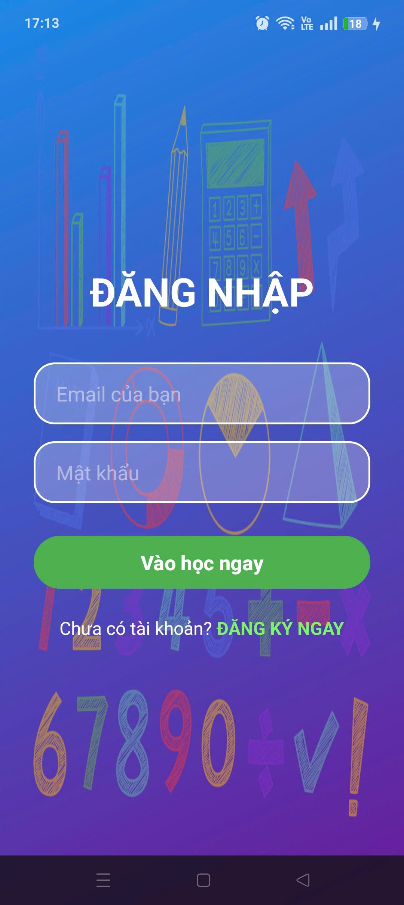
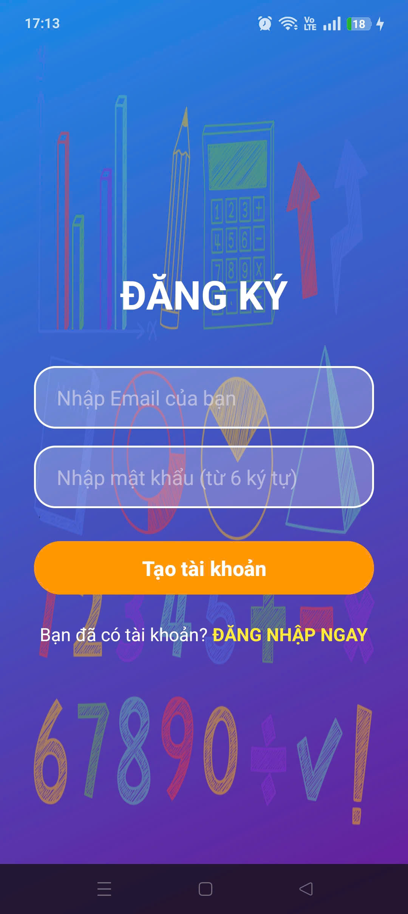
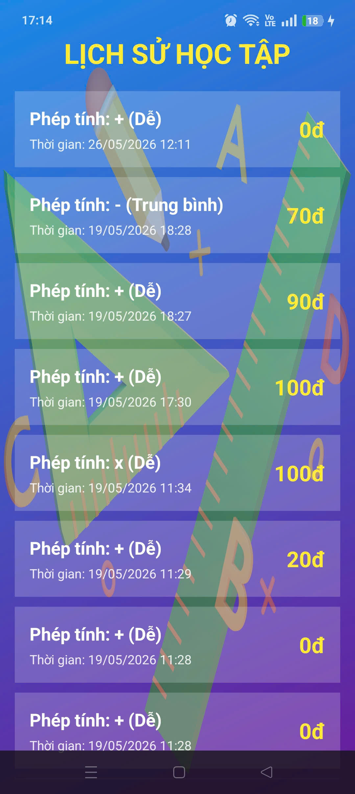
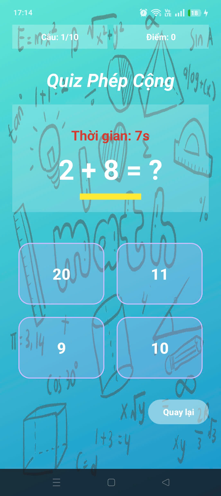
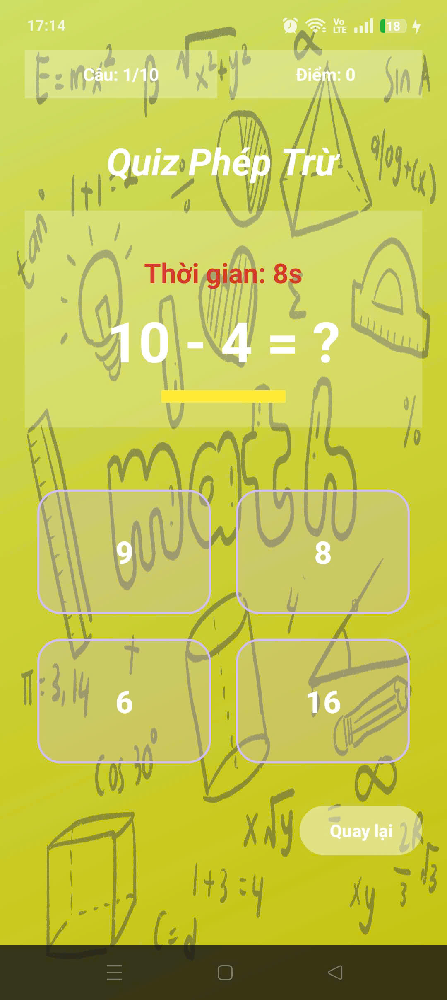
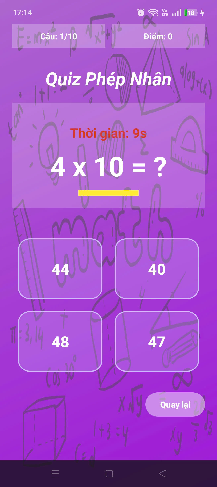
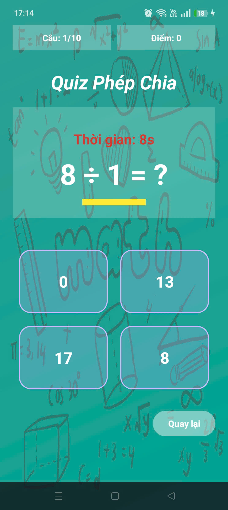

# MathMaster Quiz - Ứng Dụng Học Toán Cho Trẻ Em

Ứng dụng Android giúp học sinh tiểu học ôn luyện các phép tính cơ bản (Cộng, Trừ, Nhân, Chia) thông qua các câu hỏi trắc nghiệm tính giờ vui nhộn. Giao diện được thiết kế hiện đại, thay đổi màu sắc động theo từng phép tính và tích hợp họa tiết toán học chìm sinh động.

## Tính năng nổi bật
- Đăng ký/Đăng nhập: Xác thực người dùng qua Firebase Authentication.
- Học tập đa dạng: Tự động sinh bài tập ngẫu nhiên cho 4 phép tính: cộng, trừ, nhân, chia.
- Độ khó linh hoạt: 3 cấp độ (Dễ, Trung bình, Khó) giới hạn phạm vi số tương ứng.
- Đếm ngược thời gian: Thử thách 10 giây cho mỗi câu hỏi tăng tính hấp dẫn.
- Lưu trữ lịch sử: Đồng bộ điểm số, thời gian, độ khó lên Firebase Firestore.

## Hình ảnh giao diện (Screenshots)

### Màn hình Đăng nhập & Đăng ký
Phục vụ xác thực tài khoản học sinh.

  
  

### Màn hình chính & Lịch sử học tập
Nơi chọn độ khó, chọn phép toán và xem lại bảng điểm đã lưu trên Firebase.

  
  

### Giao diện thử thách Quiz (Đổi màu động)
Màu sắc nền thay đổi thông minh theo từng phép toán khác nhau kết hợp họa tiết toán học vẽ tay chìm.

  
  
  
  

## Video Demo Vận Hành Ứng Dụng
Dưới đây là video quay lại toàn bộ quá trình vận hành, thuật toán sinh số ngẫu nhiên và lưu điểm lên Firebase Firestore của ứng dụng:
[Bấm vào đây để xem video demo](https://drive.google.com/file/d/1Y6uuk7uyuGrgSPeLEjf-t-jQdaazuZu1/view?usp=drive_link)

